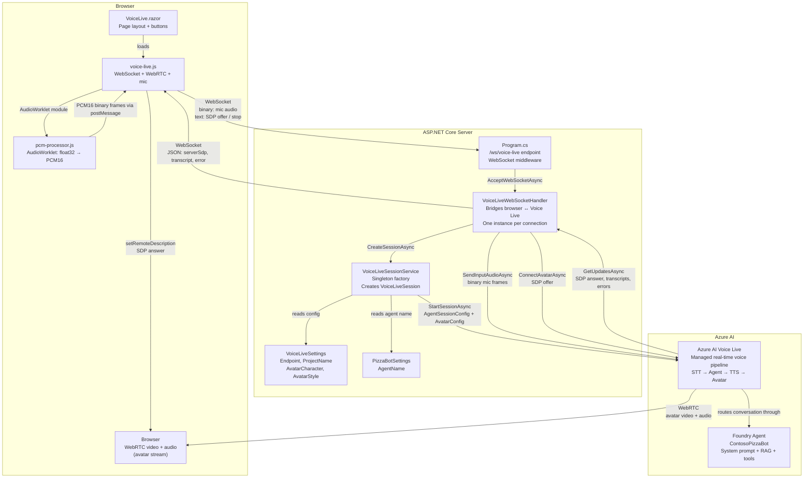
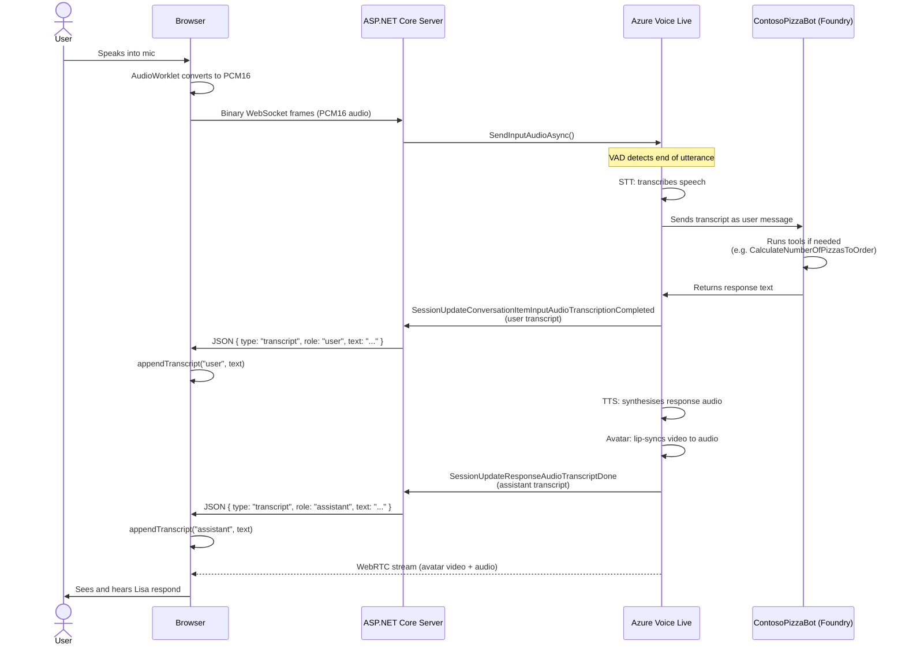
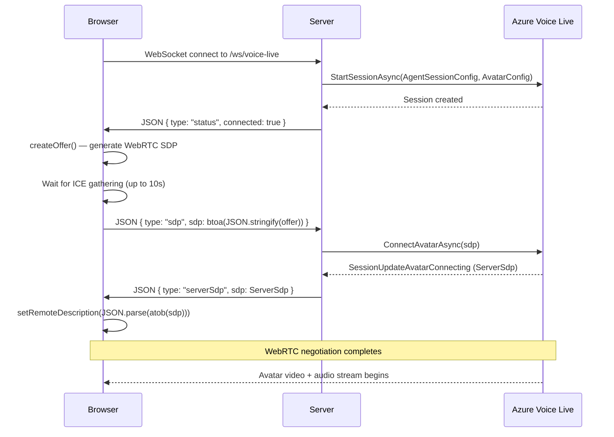

# Voice Live Architecture

> **How the `/voice-live` page works — file by file**

This document explains the Azure AI Voice Live implementation in `PizzaBot.ConsumerWeb`.
It covers what each file does, how they connect, and why the architecture is shaped the way it is.

---

## The Short Answer: What Is Voice Live?

**Azure AI Voice Live** is a managed real-time voice pipeline. You give it:
- A microphone audio stream
- A pointer to a Foundry agent

It gives you back:
- Speech recognition (STT)
- Agent responses (via the Foundry agent you point it at)
- Text-to-speech (TTS)
- A lip-syncing avatar video stream

You write almost no AI code. Voice Live manages the entire pipeline.

---

## The Question You Had: Is This the Same as the Foundry Portal?

Yes — it's the same agent. When you opened the Voice Live playground in the Azure AI Foundry portal, you were testing the same pipeline that this code builds.

The difference:
- **Portal playground** — Azure hosts everything including the browser UI; you just test it
- **This code** — we build our own browser UI and server-side bridge; we supply the WebRTC connection, the microphone, and the browser rendering

The Foundry agent (`ContosoPizzaBot`) is untouched by either path. Voice Live connects **to** it — it doesn't modify it. The agent's system prompt, RAG knowledge, and function tools (like `CalculateNumberOfPizzasToOrder`) all apply exactly as configured.

---

## Architecture Overview

---

## File Map

### Server Side

| File | Role |
|---|---|
| `Program.cs` | Registers `VoiceLiveSessionService` as a singleton. Enables WebSocket middleware. Maps the `/ws/voice-live` endpoint and hands accepted WebSocket connections to `VoiceLiveWebSocketHandler.HandleAsync`. |
| `Models/VoiceLiveSettings.cs` | Config model bound from `appsettings.json` → `"VoiceLive"` section. Holds `Endpoint`, `ProjectName`, `AvatarCharacter`, `AvatarStyle`. |
| `Services/VoiceLiveSessionService.cs` | Singleton factory. Creates one `VoiceLiveClient` at startup (authenticated via `DefaultAzureCredential`). Exposes `CreateSessionAsync()` which starts a new Voice Live session targeting the Foundry agent, with avatar streaming and audio processing enabled. |
| `Services/VoiceLiveWebSocketHandler.cs` | Per-connection handler (not a registered service — instantiated inline in the endpoint). Manages two concurrent tasks: forwarding Voice Live events to the browser (`ForwardEventsAsync`) and receiving mic audio + SDP from the browser (`ReceiveFromBrowserAsync`). All WebSocket sends go through a `SemaphoreSlim` to prevent interleaved frames. |

### Browser Side

| File | Role |
|---|---|
| `Components/Pages/VoiceLive.razor` | Blazor page at `/voice-live`. Provides the HTML layout: avatar video container, control buttons, chat history div, orders panel. Loads `voice-live.js`. |
| `wwwroot/js/voice-live.js` | All browser-side logic. Opens a WebSocket to `/ws/voice-live`. Sets up a WebRTC peer connection for the avatar stream (STUN only — Voice Live provides its own ICE candidates in the SDP answer). Captures mic via `getUserMedia`, routes audio through the AudioWorklet, and sends PCM16 binary frames over the WebSocket. Handles incoming server messages to display transcripts and connect the avatar. |
| `wwwroot/js/pcm-processor.js` | An `AudioWorkletProcessor` that runs on the audio thread. Accumulates ~100ms of float32 audio samples, converts them to PCM16 (int16), and posts them to the main thread. Voice Live requires 24 kHz mono PCM16 input. |

---

## Data Flow: One Conversation Turn

---

## Session Startup Flow

Before any conversation can happen, the WebRTC avatar connection must be established:

**Why is SDP base64-encoded?**  
Voice Live's SDK returns the SDP answer already encoded as `btoa(JSON.stringify({type, sdp}))` — exactly the format `RTCSessionDescription` expects after a `JSON.parse(atob(...))`. The server passes it through unchanged.

---

## Configuration Required

These values must be provided (not committed — use user secrets or environment variables):

| Key | Where to set | Example value |
|---|---|---|
| `VoiceLive:Endpoint` | User secrets / env var | `https://myresource.cognitiveservices.azure.com/` |
| `VoiceLive:ProjectName` | User secrets / env var | `my-foundry-project` |
| `PizzaBot:AgentName` | `appsettings.json` | `ContosoPizzaBot` |

These have defaults in `appsettings.json`:

| Key | Default |
|---|---|
| `VoiceLive:AvatarCharacter` | `lisa` |
| `VoiceLive:AvatarStyle` | `casual-sitting` |

**Authentication:** `DefaultAzureCredential` — works with `az login` locally and managed identity in Azure. No API keys needed.

---

## Key Design Decisions

**Why a server-side WebSocket bridge?**  
The `Azure.AI.VoiceLive` .NET SDK authenticates using `DefaultAzureCredential` (Entra ID). The browser-side JS SDK would need to attach an `Authorization` header to its WebSocket, which browsers don't allow. The server bridge also means no credentials are ever sent to the browser.

**Why STUN only (no TURN)?**  
Voice Live provides its own ICE candidates in the SDP answer it returns. It manages its own media relay infrastructure. Using Speech SDK TURN credentials (from `/api/getIceToken`) for a Voice Live session causes connectivity failures because those TURN servers are scoped to a different service.

**Why `AzureSemanticVadTurnDetectionEn` with 500ms silence?**  
Voice Live defaults to a longer silence window before declaring end-of-utterance. At the default, the session can feel unresponsive — you stop talking and nothing happens for a beat. 500ms fires sooner. `AzureSemanticVadTurnDetectionEn` is the English-optimised semantic VAD model; it understands natural pauses in speech rather than treating any silence as turn-end.

**Why echo cancellation?**  
Without it, the avatar's own speaker output (Lisa's voice) feeds back into the microphone. The VAD detects continuous audio and either fails to detect turn-end or treats Lisa's speech as user input. `InputAudioEchoCancellation` removes this feedback loop.
